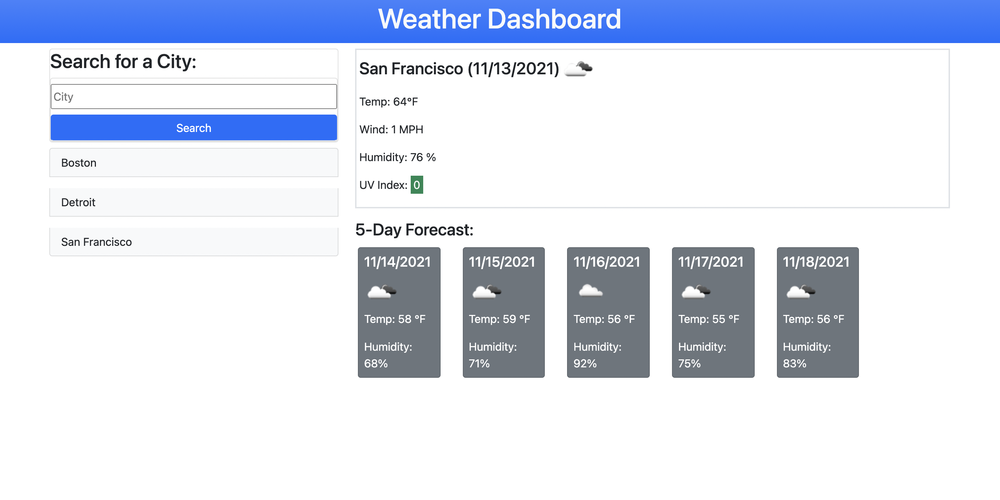

# weather-dashboard
This project was designed as a homework for my coding bootcamp.

## User story
AS A traveler
I WANT to see the weather outlook for multiple cities
SO THAT I can plan a trip accordingly

## Description
This project is a Weather dashboard. The <a href="https://openweathermap.org/api/one-call-api" target="blank">OpenWeather One Call API</a> was used to retrieve weather data for cities.

The  weather dashboard is given with form imputs and the search button.

When the user search for a city, they are presented with the current weather conditions and the forecast of the next 5 days.

The current weather condititons for that city is described with the city name, the date, an icon representation of the weather conditions, the temperature in Fahrenheit, the humidity, the wind speed, and the UV index.

The UV index is presented with a clor that indicates whether the conditions are favorable, moderate or severe.

The 5-day forecast displays the date, an icon representation of weather conditions, the temperature, the wind speed and the humidity.

After the user refreshs the page, They are presented with the last seached city's current weather and 5-day forecast, and the list of the cities in the seach history. When one of the cities in the list is clicked, the user is presented with the current and future conditions for that city.

